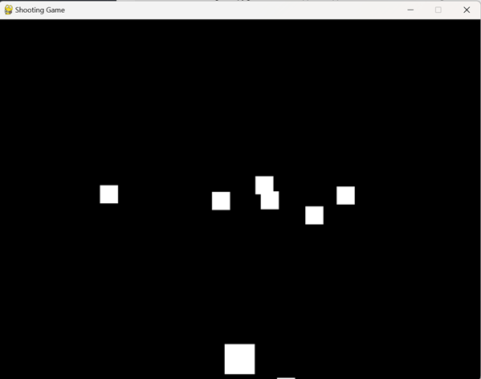
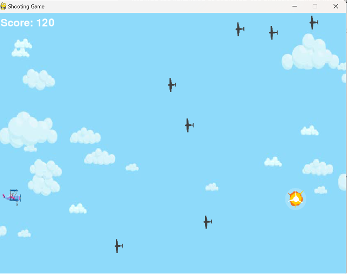

## Part3: Example of Using Cursor AI to build a Shotting game

Below is the example of using [Cursor AI](https://www.cursor.com/) to build a shotting game with giving images and sounds.

In my project folder, I add a `.cursorrules` file to describe the coding style of Cursor AI.

```txt
You are an expert of Python programming.

Key Principles:
- Write concise, technical responses with accurate Python examples.
- Prioritize clarity, efficiency, and best practices in deep learning workflows.
- Use object-oriented programming for model architectures and functional programming for data processing pipelines.
- Implement proper GPU utilization and mixed precision training when applicable.
- Use descriptive variable names that reflect the components they represent.
- Follow PEP 8 style guidelines for Python code.


Key Conventions:
1. Begin projects with clear problem definition and dataset analysis.
2. Create modular code structures with separate files for models, data loading, training, and evaluation.
3. Use configuration files (e.g., YAML) for hyperparameters and model settings.
4. Implement proper experiment tracking and model checkpointing.
5. Use version control (e.g., git) for tracking changes in code and configurations.


Make sure to:
- Use descriptive variable names.
- Include comments explaining each step of the process.
- Format the output to display the result clearly.
- Use proper indentation and follow Python coding conventions.
- Keep the code simple and easy to understand for beginners

```


## 1. Round 1

**[Me]** *please use image in the folder to create a python shotting game*

**[Cursor]** *I'll help you create a simple shooting game in Python using Pygame. Since I don't have access to the actual images in your folder, I'll provide a template that you can modify with your own images. Here's a basic shooting game structure:*

[source code #1](./mygame1.py)
```python
import pygame
import random
import os

# Initialize Pygame
pygame.init()

# Constants
SCREEN_WIDTH = 800
SCREEN_HEIGHT = 600
FPS = 60

# Colors
WHITE = (255, 255, 255)
BLACK = (0, 0, 0)

# Create the game window
screen = pygame.display.set_mode((SCREEN_WIDTH, SCREEN_HEIGHT))
pygame.display.set_caption("Shooting Game")
clock = pygame.time.Clock()

class Player(pygame.sprite.Sprite):
    def __init__(self):
        super().__init__()
        # Replace 'player.png' with your player image
        self.image = pygame.Surface((50, 50))  # Placeholder rectangle
        self.image.fill(WHITE)
        self.rect = self.image.get_rect()
        self.rect.centerx = SCREEN_WIDTH // 2
        self.rect.bottom = SCREEN_HEIGHT - 10
        self.speed_x = 0

    def update(self):
        # Player movement
        self.speed_x = 0
        keys = pygame.key.get_pressed()
        if keys[pygame.K_LEFT]:
            self.speed_x = -5
        if keys[pygame.K_RIGHT]:
            self.speed_x = 5
        
        self.rect.x += self.speed_x
        
        # Keep player on screen
        if self.rect.right > SCREEN_WIDTH:
            self.rect.right = SCREEN_WIDTH
        if self.rect.left < 0:
            self.rect.left = 0

class Bullet(pygame.sprite.Sprite):
    def __init__(self, x, y):
        super().__init__()
        # Replace 'bullet.png' with your bullet image
        self.image = pygame.Surface((5, 10))  # Placeholder rectangle
        self.image.fill(WHITE)
        self.rect = self.image.get_rect()
        self.rect.centerx = x
        self.rect.bottom = y
        self.speed_y = -10

    def update(self):
        self.rect.y += self.speed_y
        if self.rect.bottom < 0:
            self.kill()

class Enemy(pygame.sprite.Sprite):
    def __init__(self):
        super().__init__()
        # Replace 'enemy.png' with your enemy image
        self.image = pygame.Surface((30, 30))  # Placeholder rectangle
        self.image.fill(WHITE)
        self.rect = self.image.get_rect()
        self.rect.x = random.randrange(SCREEN_WIDTH - self.rect.width)
        self.rect.y = random.randrange(-100, -40)
        self.speed_y = random.randrange(1, 4)

    def update(self):
        self.rect.y += self.speed_y
        if self.rect.top > SCREEN_HEIGHT:
            self.rect.x = random.randrange(SCREEN_WIDTH - self.rect.width)
            self.rect.y = random.randrange(-100, -40)
            self.speed_y = random.randrange(1, 4)

# Create sprite groups
all_sprites = pygame.sprite.Group()
enemies = pygame.sprite.Group()
bullets = pygame.sprite.Group()

# Create player
player = Player()
all_sprites.add(player)

# Create initial enemies
for i in range(8):
    enemy = Enemy()
    all_sprites.add(enemy)
    enemies.add(enemy)

# Game loop
running = True
while running:
    # Keep loop running at the right speed
    clock.tick(FPS)
    
    # Process input (events)
    for event in pygame.event.get():
        if event.type == pygame.QUIT:
            running = False
        elif event.type == pygame.KEYDOWN:
            if event.key == pygame.K_SPACE:
                bullet = Bullet(player.rect.centerx, player.rect.top)
                all_sprites.add(bullet)
                bullets.add(bullet)

    # Update
    all_sprites.update()

    # Check for bullet/enemy collisions
    hits = pygame.sprite.groupcollide(enemies, bullets, True, True)
    for hit in hits:
        enemy = Enemy()
        all_sprites.add(enemy)
        enemies.add(enemy)

    # Check for player/enemy collisions
    hits = pygame.sprite.spritecollide(player, enemies, False)
    if hits:
        running = False

    # Draw / render
    screen.fill(BLACK)
    all_sprites.draw(screen)
    
    # Flip display
    pygame.display.flip()

# Quit game
pygame.quit()
```

**To use this code with your own images:**

1. Replace the placeholder surfaces with your actual images using:

```python
    self.image = pygame.image.load('your_image.png').convert()
self.image.set_colorkey(BLACK)  # If you want transparency
```

2. Place your images in the same directory as the script or provide the correct path.
3. You might need to adjust the size and speed parameters based on your images.

**This game includes:**

- A player that moves left and right with arrow keys
- Shooting bullets with the spacebar
- Enemies that fall from the top of the screen
- Collision detection between bullets and enemies
- Game over when an enemy hits the player

**Features you can add:**
- Score counter
- Sound effects
- Power-ups
- Different enemy types
- Background image
- Health system
- Game over screen

Remember to handle the images properly:
```python
self.image = pygame.image.load('your_image.png').convert()
self.image.set_colorkey(BLACK)  # If you want transparency
``` 

Then use these images in your sprite classes instead of the placeholder surfaces.



<div align="center">
  <video width="320" height="240" controls>
    <source src="./screenshot/mygame1.mp4" type="video/mp4">
    Your browser does not support the video tag.
  </video>
</div>


## 2. Round 2

**[Me]** *I have images player.png, bullet.png, enemy1.png and sky.jpg for backgroud,  could you update the code to use them*

**[Cursor]** *I'll modify the code to use your specific images. Here's the updated version:*

[source code #2](./mygame2.py)
```python
import pygame
import random
import os

# Initialize Pygame
pygame.init()

# Constants
SCREEN_WIDTH = 800
SCREEN_HEIGHT = 600
FPS = 60

# Colors
WHITE = (255, 255, 255)
BLACK = (0, 0, 0)

# Create the game window
screen = pygame.display.set_mode((SCREEN_WIDTH, SCREEN_HEIGHT))
pygame.display.set_caption("Shooting Game")
clock = pygame.time.Clock()

# Load all images
# Load and scale background
background = pygame.image.load('sky.jpg').convert()
background = pygame.transform.scale(background, (SCREEN_WIDTH, SCREEN_HEIGHT))

# Load game images
player_img = pygame.image.load('player.png').convert_alpha()
bullet_img = pygame.image.load('bullet.png').convert_alpha()
enemy_img = pygame.image.load('enemy1.png').convert_alpha()

# Scale images if needed (adjust sizes as needed)
player_img = pygame.transform.scale(player_img, (50, 50))
bullet_img = pygame.transform.scale(bullet_img, (10, 20))
enemy_img = pygame.transform.scale(enemy_img, (40, 40))

class Player(pygame.sprite.Sprite):
    def __init__(self):
        super().__init__()
        self.image = player_img
        self.rect = self.image.get_rect()
        self.rect.centerx = SCREEN_WIDTH // 2
        self.rect.bottom = SCREEN_HEIGHT - 10
        self.speed_x = 0

    def update(self):
        self.speed_x = 0
        keys = pygame.key.get_pressed()
        if keys[pygame.K_LEFT]:
            self.speed_x = -5
        if keys[pygame.K_RIGHT]:
            self.speed_x = 5
        
        self.rect.x += self.speed_x
        
        if self.rect.right > SCREEN_WIDTH:
            self.rect.right = SCREEN_WIDTH
        if self.rect.left < 0:
            self.rect.left = 0

class Bullet(pygame.sprite.Sprite):
    def __init__(self, x, y):
        super().__init__()
        self.image = bullet_img
        self.rect = self.image.get_rect()
        self.rect.centerx = x
        self.rect.bottom = y
        self.speed_y = -10

    def update(self):
        self.rect.y += self.speed_y
        if self.rect.bottom < 0:
            self.kill()

class Enemy(pygame.sprite.Sprite):
    def __init__(self):
        super().__init__()
        self.image = enemy_img
        self.rect = self.image.get_rect()
        self.rect.x = random.randrange(SCREEN_WIDTH - self.rect.width)
        self.rect.y = random.randrange(-100, -40)
        self.speed_y = random.randrange(1, 4)

    def update(self):
        self.rect.y += self.speed_y
        if self.rect.top > SCREEN_HEIGHT:
            self.rect.x = random.randrange(SCREEN_WIDTH - self.rect.width)
            self.rect.y = random.randrange(-100, -40)
            self.speed_y = random.randrange(1, 4)

# Create sprite groups
all_sprites = pygame.sprite.Group()
enemies = pygame.sprite.Group()
bullets = pygame.sprite.Group()

# Create player
player = Player()
all_sprites.add(player)

# Create initial enemies
for i in range(8):
    enemy = Enemy()
    all_sprites.add(enemy)
    enemies.add(enemy)

# Score
score = 0
font = pygame.font.Font(None, 36)

# Game loop
running = True
while running:
    # Keep loop running at the right speed
    clock.tick(FPS)
    
    # Process input (events)
    for event in pygame.event.get():
        if event.type == pygame.QUIT:
            running = False
        elif event.type == pygame.KEYDOWN:
            if event.key == pygame.K_SPACE:
                bullet = Bullet(player.rect.centerx, player.rect.top)
                all_sprites.add(bullet)
                bullets.add(bullet)

    # Update
    all_sprites.update()

    # Check for bullet/enemy collisions
    hits = pygame.sprite.groupcollide(enemies, bullets, True, True)
    for hit in hits:
        score += 10  # Increase score for each hit
        enemy = Enemy()
        all_sprites.add(enemy)
        enemies.add(enemy)

    # Check for player/enemy collisions
    hits = pygame.sprite.spritecollide(player, enemies, False)
    if hits:
        running = False

    # Draw / render
    screen.blit(background, (0, 0))  # Draw background
    all_sprites.draw(screen)
    
    # Draw score
    score_text = font.render(f'Score: {score}', True, WHITE)
    screen.blit(score_text, (10, 10))
    
    # Flip display
    pygame.display.flip()

# Game over screen
screen.blit(background, (0, 0))
game_over_text = font.render(f'Game Over! Final Score: {score}', True, WHITE)
text_rect = game_over_text.get_rect(center=(SCREEN_WIDTH/2, SCREEN_HEIGHT/2))
screen.blit(game_over_text, text_rect)
pygame.display.flip()

# Wait a few seconds before closing
pygame.time.wait(3000)

# Quit game
pygame.quit()
```

**Key changes made:**

1. Added loading of specific image files ('player.png', 'bullet.png', 'enemy1.png', 'sky.jpg')
2. Added background image with proper scaling
3. Added score display
4. Added game over screen
5. Added image scaling (you may need to adjust the sizes based on your actual images)
6. Added alpha channel support for transparent images
7. Added a 3-second delay after game over before closing

Make sure all image files are in the same directory as your Python script. You might need to adjust the image scaling values based on your actual image sizes:

```python
player_img = pygame.transform.scale(player_img, (50, 50))  # Adjust size as needed
bullet_img = pygame.transform.scale(bullet_img, (10, 20))  # Adjust size as needed
enemy_img = pygame.transform.scale(enemy_img, (40, 40))    # Adjust size as needed
``` 

**Controls:**
- Left/Right arrow keys to move
- Spacebar to shoot
- Close window to quit

**The game now includes:**
- Background image
- Score counter
- Game over screen
- Proper sprite images
- Transparent images support

**You can further enhance the game by adding:**
- Sound effects
- Multiple enemy types
- Power-ups
- Lives system
- High score system
- Menu screen


<div align="center">
  <video width="320" height="240" controls>
    <source src="./screenshot/mygame2.mp4" type="video/mp4">
    Your browser does not support the video tag.
  </video>
</div>

## 3. Round 3

**[Me]** *change the  game  to horizontal, the player in the left, and enmy come from right end,  also add pew.wav as sound of shooting and expl.wav as sound of explosion*

**[Cursor]** *I'll modify the game to be horizontal with enemies coming from the right and add sound effects. Here's the updated code:*

[source code #3](./mygame3.py)

**Key changes made:**

1. Changed player position to left side of screen
2. Modified player movement to up/down instead of left/right
3. Rotated player, bullet, and enemy sprites 90 degrees
4. Changed bullet direction to move right
5. Changed enemies to spawn from right side and move left
6. Added sound effects for shooting and explosions
7. Modified collision detection for horizontal gameplay

**Controls:**

- Up/Down arrow keys to move
- Spacebar to shoot
- Close window to quit

Make sure you have the sound files ('pew.wav' and 'expl.wav') in the same directory as your Python script. 

**The game now features:**

- Horizontal scrolling gameplay
- Sound effects for shooting and explosions
- Proper sprite rotations for horizontal gameplay
- Score tracking
- Game over screen
- Background image


<div align="center">
  <video width="320" height="240" controls>
    <source src="./screenshot/mygame3.mp4" type="video/mp4">
    Your browser does not support the video tag.
  </video>
</div>

## 4. Round 4

**[Me]** *add the animation of explotion, the explotion images are Explosion00.png to Explosion08.png.  also remove the rotation of current images for player,bullet and enemy*

**[Cursor]** *I'll modify the code to add explosion animation and remove the rotations. Here's the updated version:*

[source code #4](./mygame4.py)

**Key changes made:**

1. Added Explosion class for handling explosion animations
2. Removed rotations from player, bullet, and enemy sprites
3. Added explosion animation when enemies are hit
4. Created new sprite group for explosions
5. Added loading of explosion animation frames
6. Adjusted bullet size to be more horizontal

The explosion animation will now play whenever an enemy is hit by a bullet. Make sure all the explosion image files (Explosion00.png through Explosion08.png) are in the same directory as your Python script.
You can adjust the explosion animation speed by changing the frame_rate value in the Explosion class. Lower values will make the animation faster, higher values will make it slower.

**The game now features:**
- Explosion animations
- Non-rotated sprites
- Sound effects
- Score tracking
- Game over screen
- Background image



<div align="center">
  <video width="320" height="240" controls>
    <source src="./screenshot/mygame4.mp4" type="video/mp4">
    Your browser does not support the video tag.
  </video>
</div>

## 5 Conclusion

I had used 4 rounds to build a shooting game use my material.

Cursor Can understand my command even I have typos in the prompt, which is super cool.

Cursor AI is a powerful tool for building Python projects. It can help you create complex applications quickly and efficiently. However, it is important to note that Cursor AI is not a substitute for human coding. It is a tool that can help you write code faster, but you still need to understand the code and the underlying concepts.

Cursor AI is a tool that can help you write code faster, but you still need to understand the code and the underlying concepts.


