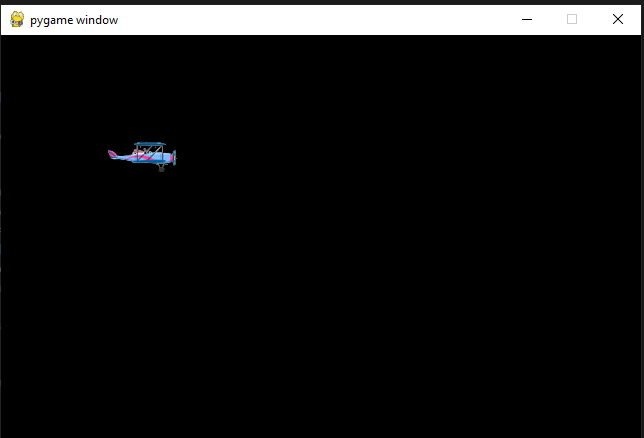
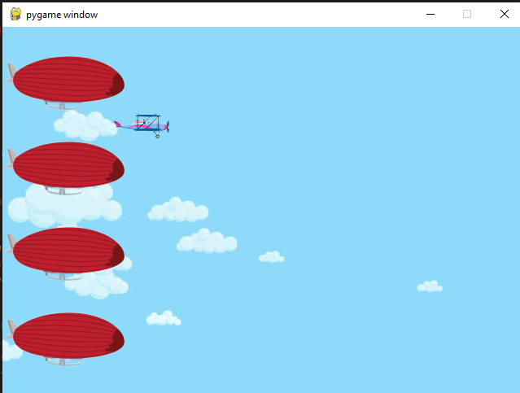
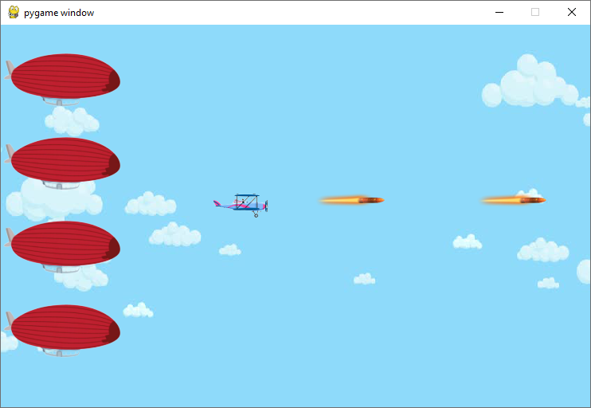
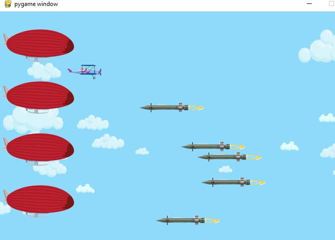
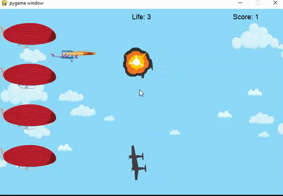

# AirForce

 This is a simple python game write with pyGame. For educational purpose, I used 3 different way to build the game.

 - [Part 1](https://stoneskin.github.io/AirForce/#part-1-build-game-with-basic-game-loop-and-basic-game-object), Implements with the basic game loop and basic game object.
 - [Part 2](https://stoneskin.github.io/AirForce/Part2_OOO.html#part2-rewrite-the-game-with-oop), Rewrote the code with Object-Oriented Programming (OOP) style.
 - [Part 3](https://stoneskin.github.io/AirForce/CursorExample/#part3-example-of-using-cursor-ai-to-build-a-shotting-game), Use prompts to let the [Cursor AI](https://www.cursor.com/) to build the AirForce game.


## Part 1: Build Game with basic game loop and basic game object

- [Step 1](#step1-initial-the-pygame): Initialize PyGame
- [Step 2](#step2-load-background-and-additional-objects): Load Background and Additional Objects
- [Step 3](#step3-make-the-player-moving-with-awsd-key-press): Make the Player Move with AWSD Key Press
- [Step 4](#step4-let-the-airplane-fire-bullets): Let the Airplane Fire Bullets
- [Step 5](#step5-add-enemies): Add Enemies
- [Step 6](#step6-check-for-collisions): Check for Collisions
- [Step 7](#step7-add-explosion-animation): Add Explosion Animation
- [Step 8](#step8-load-sound-and-play-music): Load Sound and Play Music
- [Step 9](#step9-draw-text-for-score-life-and-game-over): Draw Text for Score, Life, and Game Over


### Step1 Initial the PYGame

- Create a project folder, and add a images folder in the project folder
`\yourProject\`
`\yourProject\images\`

- Prepare a image for the player of your game:


**Hint:** *You could use the <https://www.remove.bg/> to remove background of your images for game*

- Create a py file with below code

```python
# step 1, init the game and load image

# 1.1 - Import library
import pygame

# 1.2 - Initialize the game 
pygame.init()
width, height = 640, 480
screen=pygame.display.set_mode((width, height))
keep_going = True

# 1.3 - Load images
player = pygame.image.load("images/player.png")

# 1.4 - use loop to keep the game running 
while keep_going:
    # 1.5 - clear the screen before drawing it again
    screen.fill(0)
    #1.6 - draw the screen elements
    screen.blit(player, (100,100))
    #1.7 - update the screen
    pygame.display.flip() # will update the contents of the entire display, and faster than .update()
    # 1.8 - loop through the events
    for event in pygame.event.get():
        # check if the event is the X button
        if event.type==pygame.QUIT:
            keep_going = False
            

#1.9 exit pygame and python
pygame.quit()
exit(0) 
```


[Source Code of Step1](./step1.py)

### 2 Step 2: Load background and additional objects

- Prepare images of a background
  `background = pygame.image.load("images/sky.jpg")`

  There are different ways to load background,
  1. you could use one big image
  `screen.blit(background,(0,0))`
  
  2. you could change your image to fit the screen size
    `background = pygame.transform.scale(background, (width, height))`

  3. if you image is small, you need use double loop to fill the background

  ```python
    for x in range( int(width/background.get_width())+1):
        for y in range(int(height/background.get_height())+1):
            screen.blit(background,(x*100,y*100))
  ```
  
  

- Prepare a air balloon as cargo you need protect
   - `cargo = pygame.image.load("images/airballoon.png")`
  

  - Load multiple cargo
  ```python
    screen.blit(cargo,(0,30))
    screen.blit(cargo,(0,135))
    screen.blit(cargo,(0,240))
    screen.blit(cargo,(0,345))
  ```
  - do yourself: use `list` and loop to load air balloon

  ```python
  ##initial
  balloons=[]
  for(i in range(4)):
      balloons.append([0,(30+i*100)])
  # in run loop
  for(balloonPos in balloons):
     screen.blit(cargo,balloonPos) 
  ```

 - The full code example
  
```python
#Step2, Load background and cargo
import pygame

pygame.init()
width, height = 640, 480
screen=pygame.display.set_mode((width, height))
keep_going = True


player = pygame.image.load("images/player.png")

#---------------------------------------------
#2.1 load more images
background = pygame.image.load("images/sky.jpg")
cargo = pygame.image.load("images/airballoon.png")
#---------------------------------------------

while keep_going:

    screen.fill(0)
    
    #----------------------------------------
    #2.2 load the background
    screen.blit(background,(0,0))
    # if you image is small, you need use double loop to fill the background
    #for x in range( int(width/background.get_width())+1):
    #    for y in range(int(height/background.get_height())+1):
    #        screen.blit(background,(x*100,y*100))
    
    # 2.3 load the balloon cargo
    screen.blit(cargo,(0,30))
    screen.blit(cargo,(0,135))
    screen.blit(cargo,(0,240))
    screen.blit(cargo,(0,345))
    #----------------------------------------

    screen.blit(player, (130,100))
    
    pygame.display.flip() 
    
    for event in pygame.event.get():
        if event.type==pygame.QUIT:
            keep_going = False

pygame.quit()
exit(0)
```
[SourceCode of Step 2](./step2.py)



### Step 3: Make the player moving with AWSD key press


- 3.1 initial the value of Key and position

```python

key_up=key_down=key_left=key_right = False
player_pos=[130,100]
```

- 3.2 in running loop, set the player position
  
  `screen.blit(player, player_pos)`

- 3.3 the Event driven code use the pygame.KEYDOWN
  
  ```python
  #3.3 monitor the key down and up
    for event in pygame.event.get():
        if event.type==pygame.QUIT:
            keep_going = False
        if event.type == pygame.KEYDOWN:
            if event.key==pygame.K_w:
                key_up=True
            elif event.key==pygame.K_a:
                key_left=True
            elif event.key==pygame.K_s:
                key_down=True
            elif event.key==pygame.K_d:
                key_right=True
        if event.type == pygame.KEYUP:
            if event.key==pygame.K_w:
                key_up=False
            elif event.key==pygame.K_a:
                key_left=False
            elif event.key==pygame.K_s:
                key_down=False
            elif event.key==pygame.K_d:
                key_right=False
  ```

- 3.4 change the player position base on the key status
  
  ```python
    if key_up:
        player_pos[1]-=1
    elif key_down:
        player_pos[1]+=1
    if key_left:
        player_pos[0]-=1
    elif key_right:
        player_pos[0]+=1
  ```

 Add more code to limited the position of player could move

  ```python
    if key_up and player_pos[1]>0:
        player_pos[1]-=1
    elif key_down and player_pos[1]<height-30:
        player_pos[1]+=1
    if key_left and player_pos[0]>0:
        player_pos[0]-=1
    elif key_right and player_pos[0]<width-100:
        player_pos[0]+=1
  ```

[Source Code of Step 3](/step3.py)

### Step4: Let air plane fire bullet

- Prepare the bullet
  

    ```python
    #initial bullets
    bullets=[]
    bullet = pygame.image.load("images/bullet.png")

    ```

- Draw the bullet in screen
  
    ```python
    #4 - Draw bullet
    index=0 
    for bulletPos in bullets:

        bulletPos[0]=bulletPos[0]+1
        screen.blit(bullet,bulletPos)

        #remove bullet if out the screen
        if bulletPos[0]<-64 or bulletPos[0]>640 or bulletPos[1]<-64 or bulletPos[1]>480:
            bullets.pop(index)  #remove from list
        index+=1  
  
   ```

- Mouse Click or space key down to fire

    ```python
    # use mouse click or space to fire         
    if event.type==pygame.MOUSEBUTTONDOWN or (event.type==pygame.KEYDOWN and event.key==pygame.K_SPACE):
        bullets.append([player_pos[0],player_pos[1]]) 
    ```



[Source Code of Step4](/step4.py) 

### Step 5: Add Enemies

- Prepare images for enemies  


- initial the code for Enemies
  
```python
#5 initial enemies
    enemyImg = pygame.image.load("images/enemy2.png")
    enemys=[[640,100]]
    enemySpeed=-0.5
    enemyMaxnumber=5 #how many enemies in the screen same time
```

- in the keep_going loop , draw enemies

```python  
 #5 Draw enemies random time and only keep 5 enemies in screen
    if(random.randint(1,100)<3 and len(enemys)<enemyMaxnumber): 
        enemys.append([640, random.randint(50,430)]) 

    index=0
    for enemyPos in enemys:               
        enemyPos[0]+=enemySpeed
        if enemyPos[0]<50:
            enemys.pop(index)
        screen.blit(enemyImg, enemyPos)
        index+=1   
#end step 5
```

- Load a different Enemy image

```python
    #5 enemy
    enemyImg = pygame.image.load("images/enemy1.png")
    enemyImg=pygame.transform.scale(enemyImg, (75, 75))
    enemys=[[640,100]]
    enemySpeed=-0.3
    enemyMaxnumber=5
```

- Add code remove enemies
  
```python

#4 - Draw bullet
    enemy_index=0
    for bulletPos in bullets:    
        bulletPos[0]=bulletPos[0]+2
        screen.blit(bullet,bulletPos)

        #remove bullet if out the screen
        if bulletPos[0]<-64 or bulletPos[0]>640 or bulletPos[1]<-64 or bulletPos[1]>480:
            bullets.pop(enemy_index)  #remove from list
        enemy_index+=1
```

- results
  
 

 [Code with step 5](/step5.py)

### Step 6: Check the collision

- update code in the loop of enemies

```python
    enemy_index=0
    for enemyPos in enemys:               
        enemyPos[0]+=enemySpeed
        if enemyPos[0]<50:
            enemys.pop(enemy_index)
        screen.blit(enemyImg, enemyPos)
        
    # 6 Check for collisions
        enemyRect=pygame.Rect(enemyImg.get_rect())
        enemyRect.left=enemyPos[0]
        enemyRect.top=enemyPos[1]
        bullet_index=0
        for bulletPos in bullets:
            bulletRect=pygame.Rect(bullet.get_rect()) # get rect of bullet image size
            bulletRect.left=bulletPos[0]
            bulletRect.top=bulletPos[1]            
            if bulletRect.colliderect(enemyRect):
                enemys.pop(enemy_index)
                bullets.pop(bullet_index)
            bullet_index+=1               
    # end step 6
        enemy_index+=1

```

- source code
  
  [Code with step 6](/step6.py)

### Step 7: Add explosion animation

- prepare images of explosion
  [download all explosion images](/images/explosions.zip)
  
- initial explosion before `keep_going` loop

```python
#7 initial load explosion animation images
explosions=[] # store explosion location and img index [(x,y),i,t] 
explosion_anim=[] #store img for animation
BLACK = (0, 0, 0)
explosion_time=60
for i in range(9):
    filename = 'Explosion0{}.png'.format(i)
    img = pygame.image.load("images/"+ filename).convert()  # convert will create a copy that will draw more quickly on the screen.
    img.set_colorkey(BLACK)
    img= pygame.transform.scale(img, (75, 75))
    explosion_anim.append(img)
    
```

- add explosion code before display update
  
```python
    #step 7 plan explosion animation    
    for explosion in explosions:
        if(explosion[1]<9):
            screen.blit(explosion_anim[explosion[1]],explosion[0])
            explosion[2]=explosion[2]-1
            if(explosion[2]<0):     
                explosion[1]=explosion[1]+1
                explosion[2]=explosion_time
                
        else:
            explosions.pop(0) # the first one is always first completed 
    #end step7
```

- source code
  
  [Code with step 7](/step7.py)


### Step8: Load sound and play music

- prepare sound and music
  [download sounds](/sounds/sounds.zip)

- initial sound and music
  
  ```python
  #8 initial load sound
    shooting_sound = pygame.mixer.Sound('sounds/pew.wav')
    pygame.mixer.music.load('sounds/BG.ogg')
    pygame.mixer.music.play(-1) ### makes the gameplay sound in an endless loop
  ```

- add the sound in the collision check

```python
            if bulletRect.colliderect(enemyRect):
                enemys.pop(enemy_index)
                bullets.pop(bullet_index)

                # step7 play explosion in the location of enemy
                explosions.append([enemyPos,0,explosion_time])
```

- source code
  [src with step 8](/step8.py)

### Step9: Draw text for score, life and game over

- initial the score, life

```python
    #initial for step 9
    score=0
    life=3
    game_over=False
```

- define function for draw text
  
```python
def draw_text(surf, text, size, x, y):
    ## selecting a cross platform font to display the score
    font = pygame.font.Font(pygame.font.match_font('arial'), size)
    text_surface = font.render(text, True, BLACK)       ## True denotes the font to be anti-aliased 
    text_rect = text_surface.get_rect()
    text_rect.midtop = (x, y)
    surf.blit(text_surface, text_rect)
```

- draw life and score after load background

```python
screen.blit(background,(0,0))  

#step 9 draw life and score on 
    game_over=life<1 #step9 make game over if life small then 1

    draw_text(screen, "Score: "+str(score), 18, width -100, 10)
    draw_text(screen, "Life: "+str(life), 18, width/2, 10)
    if(game_over):
        draw_text(screen, "Game Over", 50, width/2, height/2 -40)
```

- add condition on game over

```python
    if(not game_over):
        screen.blit(player, player_pos)
    ...
    ...
```

- source code
  
  [source code with step9](/step9.py)

- final result
  
  

